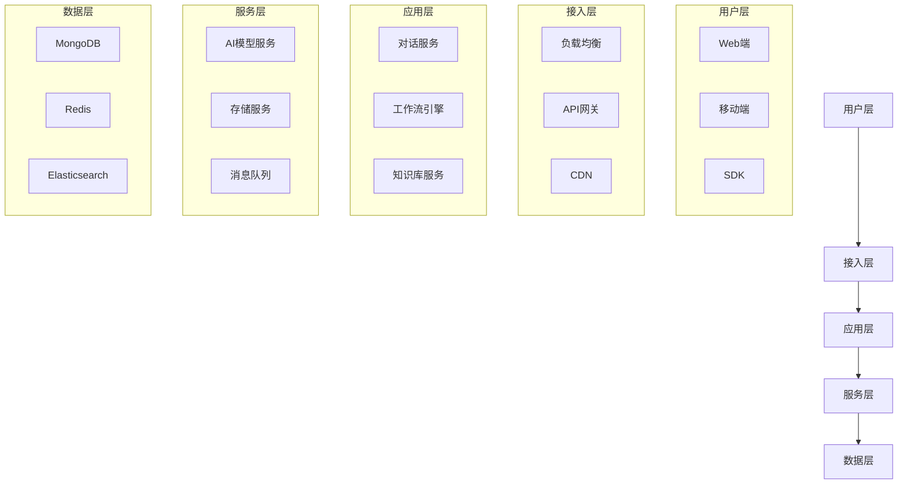
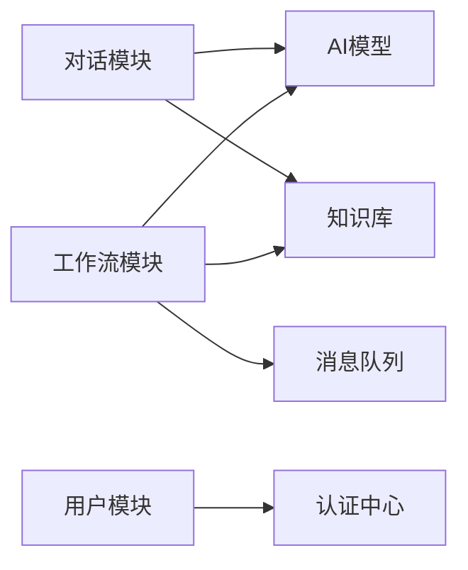

# 扣子平台系统架构

> 文档信息
- 版本：v1.0.0
- 更新日期：2024-03-15
- 状态：已发布
- 作者：曾子杰
- 标签：#架构 #系统设计 #技术栈

## 目录
- [一、系统概述](#一系统概述)
- [二、架构设计](#二架构设计)
- [三、核心模块](#三核心模块)
- [四、技术栈](#四技术栈)
- [五、系统特性](#五系统特性)

## 一、系统概述

### 1. 系统架构图


### 2. 系统特点
```json
{
    "架构特点": {
        "高可用": "多节点部署，故障自动转移",
        "可扩展": "模块化设计，水平扩展能力",
        "高性能": "分布式架构，异步处理机制",
        "安全性": "多层安全防护，数据加密传输"
    }
}
```

## 二、架构设计

### 1. 分层架构
| 层级 | 主要功能 | 核心组件 |
|------|---------|---------|
| 用户层 | 用户交互界面 | Web应用、移动应用、SDK |
| 接入层 | 请求接入和负载均衡 | Nginx、Kong、CloudFront |
| 应用层 | 业务逻辑处理 | Node.js服务、Python服务 |
| 服务层 | 基础服务支持 | AI服务、存储服务、消息服务 |
| 数据层 | 数据存储和管理 | MongoDB、Redis、Elasticsearch |

### 2. 模块关系


## 三、核心模块

### 1. 对话系统
```json
{
    "对话系统": {
        "会话管理": "对话上下文维护",
        "模型调用": "AI模型服务集成",
        "知识检索": "知识库实时检索",
        "上下文理解": "对话意图理解"
    }
}
```

### 2. 工作流引擎
```json
{
    "工作流引擎": {
        "流程编排": "节点编排和连接",
        "任务调度": "任务分发和执行",
        "状态管理": "工作流状态维护",
        "错误处理": "异常处理和恢复"
    }
}
```

## 四、技术栈

### 1. 后端技术
```json
{
    "后端技术栈": {
        "主要语言": ["Node.js", "Python"],
        "框架": ["Express", "FastAPI"],
        "数据库": ["MongoDB", "Redis"],
        "消息队列": "Kafka",
        "搜索引擎": "Elasticsearch"
    }
}
```

### 2. 前端技术
```json
{
    "前端技术栈": {
        "框架": ["React", "Vue.js"],
        "UI库": ["Ant Design", "Element UI"],
        "状态管理": ["Redux", "Vuex"],
        "构建工具": ["Webpack", "Vite"]
    }
}
```

## 五、系统特性

### 1. 性能特性
```json
{
    "性能指标": {
        "响应时间": "< 100ms",
        "并发处理": "> 1000 QPS",
        "数据处理": "> 1TB/天"
    }
}
```

### 2. 安全特性
```json
{
    "安全措施": {
        "接入安全": "HTTPS + JWT",
        "数据安全": "传输加密 + 存储加密",
        "访问控制": "RBAC权限模型",
        "审计日志": "操作审计 + 安全审计"
    }
}
```

## 参考资源

### 1. 相关文档
- [部署指南](/docs/deployment/README.md)
- [API文档](/docs/api/api_reference.md)
- [开发指南](/docs/development/README.md)
- [监控运维](/docs/monitoring/README.md)

### 2. 最佳实践
- [架构设计最佳实践](/guides/best_practices.md)
- [性能优化指南](/guides/performance.md)
- [安全实践指南](/guides/security.md)

---
> 最后更新时间：2024-03-15 