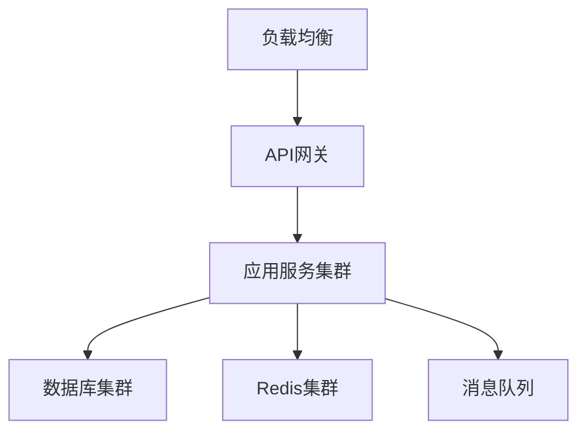

# 扣子平台部署指南

> 文档信息
- 版本：v1.0.0
- 更新日期：2024-03-15
- 状态：已发布
- 作者：运维团队
- 标签：#部署 #运维 #配置

## 目录
- [一、部署概述](#一部署概述)
- [二、环境要求](#二环境要求)
- [三、部署步骤](#三部署步骤)
- [四、配置说明](#四配置说明)
- [五、部署验证](#五部署验证)
- [六、常见问题](#六常见问题)

## 一、部署概述

### 1. 部署架构


### 2. 部署方案
```json
{
    "部署模式": {
        "单机部署": {
            "适用场景": "开发测试环境",
            "硬件要求": "8核16G以上",
            "存储要求": "100GB以上"
        },
        "集群部署": {
            "适用场景": "生产环境",
            "最小节点数": "3个应用节点",
            "推荐配置": "16核32G以上/节点"
        }
    }
}
```

## 二、环境要求

### 1. 硬件要求
| 环境类型 | CPU | 内存 | 存储 | 网络 |
|---------|-----|------|------|------|
| 开发测试 | 8核 | 16GB | 100GB | 100Mbps |
| 生产环境 | 16核 | 32GB | 500GB | 1000Mbps |

### 2. 软件要求
```json
{
    "基础环境": {
        "操作系统": ["CentOS 7+", "Ubuntu 18.04+"],
        "Docker": "20.10+",
        "Kubernetes": "1.20+",
        "Nginx": "1.18+"
    },
    "数据库": {
        "MongoDB": "4.4+",
        "Redis": "6.0+"
    },
    "消息队列": {
        "Kafka": "2.8+"
    }
}
```

## 三、部署步骤

### 1. 基础环境准备
```bash
# 安装Docker
curl -fsSL https://get.docker.com | bash

# 安装Kubernetes
curl -sfL https://get.k8s.io | sh -

# 安装Helm
curl https://raw.githubusercontent.com/helm/helm/main/scripts/get-helm-3 | bash
```

### 2. 数据库部署
```yaml
# MongoDB部署配置
apiVersion: apps/v1
kind: StatefulSet
metadata:
  name: mongodb
spec:
  replicas: 3
  selector:
    matchLabels:
      app: mongodb
  template:
    metadata:
      labels:
        app: mongodb
    spec:
      containers:
      - name: mongodb
        image: mongo:4.4
```

### 3. 应用服务部署
```yaml
# 应用服务部署配置
apiVersion: apps/v1
kind: Deployment
metadata:
  name: coze-app
spec:
  replicas: 3
  selector:
    matchLabels:
      app: coze-app
  template:
    metadata:
      labels:
        app: coze-app
    spec:
      containers:
      - name: coze-app
        image: coze/app:latest
```

## 四、配置说明

### 1. 系统配置
```json
{
    "配置项": {
        "应用配置": {
            "端口": "服务端口配置",
            "日志级别": "日志配置",
            "超时设置": "各类超时配置"
        },
        "数据库配置": {
            "连接信息": "数据库连接配置",
            "连接池": "连接池配置",
            "超时设置": "操作超时配置"
        }
    }
}
```

### 2. 环境变量
| 变量名 | 说明 | 默认值 | 示例 |
|-------|------|--------|------|
| NODE_ENV | 运行环境 | production | production |
| PORT | 服务端口 | 3000 | 3000 |
| DB_URL | 数据库地址 | - | mongodb://localhost:27017 |

## 五、部署验证

### 1. 健康检查
```bash
# 检查服务状态
kubectl get pods

# 检查日志
kubectl logs -f deployment/coze-app

# 检查端口
kubectl get svc
```

### 2. 功能验证
```json
{
    "验证项目": {
        "API接口": "验证核心API可用性",
        "数据存储": "验证数据读写正常",
        "消息队列": "验证消息收发正常"
    }
}
```

## 六、常见问题

### 1. 部署问题
1. Q: 服务无法启动？
   A: 检查配置文件和环境变量是否正确

2. Q: 数据库连接失败？
   A: 验证数据库地址和认证信息

### 2. 性能优化
```json
{
    "优化建议": {
        "应用层": {
            "节点扩容": "增加应用节点数",
            "资源配置": "调整资源限制"
        },
        "数据库层": {
            "索引优化": "创建必要索引",
            "分片策略": "合理分片配置"
        }
    }
}
```

## 参考资源

### 1. 相关文档
- [系统架构](/docs/architecture/system_architecture.md)
- [监控配置](/docs/monitoring/README.md)
- [运维手册](/docs/operation/README.md)

### 2. 工具下载
- [部署脚本](https://github.com/coze/deploy-scripts)
- [配置模板](https://github.com/coze/config-templates)

---
> 最后更新时间：2024-03-15 