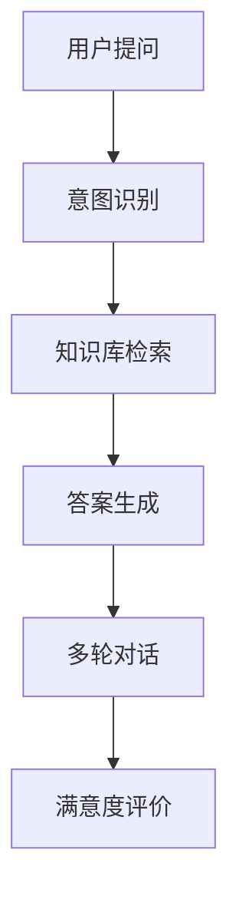
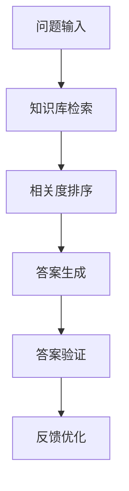

# 扣子平台使用场景指南

> 文档信息
- 版本：v1.0.0
- 更新日期：2024-03-15
- 状态：已发布
- 作者：曾子杰
- 标签：#使用场景 #最佳实践 #案例分析

## 目录
- [一、智能客服场景](#一智能客服场景)
- [二、内容生成场景](#二内容生成场景)
- [三、知识问答场景](#三知识问答场景)
- [四、流程自动化场景](#四流程自动化场景)
- [五、数据分析场景](#五数据分析场景)

## 一、智能客服场景

### 1. 场景描述
```json
{
    "应用场景": {
        "在线客服": "7x24小时智能客服服务",
        "工单处理": "自动分类和处理客服工单",
        "多轮对话": "上下文理解和持续对话",
        "知识推荐": "智能推荐相关解决方案",
        "网站集成": "在公司网站嵌入智能客服窗口",
        "APP集成": "在移动应用中添加智能问答功能",
        "系统对接": "与企业现有系统对接，实现自动化服务"
    }
}
```

### 2. 实现方案


### 3. 示例代码
```javascript
// 智能客服实现示例
const { CozeAPI } = require('@coze/node-sdk');

async function customerService(userQuery) {
    const coze = new CozeAPI({
        apiKey: 'YOUR_API_KEY'
    });

    // 1. 创建对话
    const chat = await coze.chat.create({
        messages: [{
            role: 'system',
            content: '你是一个专业的客服代表'
        }, {
            role: 'user',
            content: userQuery
        }],
        knowledge_base: 'customer_service_kb'
    });

    // 2. 获取回复
    return chat.content;
}
```

## 二、内容生成场景

### 1. 场景描述
```json
{
    "应用场景": {
        "文案生成": "营销文案、产品描述",
        "代码生成": "代码注释、单元测试",
        "报告生成": "数据分析报告、总结报告",
        "创意写作": "文章创作、故事生成"
    }
}
```

### 2. 实现方案
```json
{
    "内容生成工作流配置": {
        "1. 创建工作流": {
            "基础配置": {
                "工作流名称": "智能内容生成器",
                "描述": "自动化内容生成工作流",
                "标签": ["内容生成", "AI写作"]
            }
        },
        "2. 模板选择节点": {
            "节点类型": "模板选择器",
            "配置项": {
                "模板类别": [
                    "营销文案",
                    "产品描述",
                    "技术文档",
                    "创意写作"
                ],
                "输出变量": "selected_template",
                "参数设置": {
                    "风格定义": ["专业", "轻松", "正式", "创意"],
                    "长度控制": ["短文", "中文", "长文"]
                }
            }
        },
        "3. 内容生成节点": {
            "节点类型": "AI生成器",
            "参数配置": {
                "温度": 0.7,
                "最大长度": 2000,
                "生成策略": "流式生成",
                "关键词提取": true,
                "变量映射": {
                    "输入": {
                        "template": "selected_template",
                        "style": "selected_style",
                        "keywords": "extracted_keywords"
                    },
                    "输出": "generated_content"
                }
            }
        },
        "4. 质量检查节点": {
            "节点类型": "内容审核",
            "检查项目": {
                "语法检查": {
                    "启用": true,
                    "阈值": 0.9
                },
                "内容相关性": {
                    "启用": true,
                    "最小相关度": 0.8
                },
                "关键词覆盖": {
                    "启用": true,
                    "最小覆盖率": 0.7
                },
                "原创性检查": {
                    "启用": true,
                    "最小原创度": 0.8
                }
            },
            "处理规则": {
                "通过": "直接发送到下一节点",
                "需要优化": "返回生成节点重新生成",
                "不通过": "触发人工审核"
            }
        }
    }
}
```

### 3. 示例代码
```python
# 内容生成示例
from coze_sdk import CozeAPI

def generate_content(topic, style):
    coze = CozeAPI(api_key='YOUR_API_KEY')
    
    # 1. 创建内容生成工作流
    workflow = coze.workflow.create({
        'name': 'content_generation',
        'nodes': [
            {
                'type': 'content_planning',
                'params': {'topic': topic, 'style': style}
            },
            {
                'type': 'content_generation',
                'params': {'max_length': 1000}
            },
            {
                'type': 'content_optimization',
                'params': {'quality_threshold': 0.8}
            }
        ]
    })
    
    # 2. 执行工作流
    result = workflow.execute()
    return result.content
```

## 三、知识问答场景

### 1. 场景描述
```json
{
    "应用场景": {
        "企业知识库": "内部知识检索和问答",
        "产品文档": "产品使用指南问答",
        "培训资料": "培训内容问答",
        "技术支持": "技术文档问答"
    }
}
```

### 2. 实现方案


### 3. 示例代码
```javascript
// 知识问答实现示例
async function knowledgeQA(question, knowledgeBase) {
    const coze = new CozeAPI({
        apiKey: 'YOUR_API_KEY'
    });

    // 1. 知识库检索
    const searchResult = await coze.knowledge.search({
        query: question,
        knowledge_base: knowledgeBase,
        limit: 5
    });

    // 2. 生成答案
    const answer = await coze.chat.create({
        messages: [{
            role: 'system',
            content: '基于检索到的知识回答问题'
        }, {
            role: 'user',
            content: question
        }],
        context: searchResult.documents
    });

    return answer.content;
}
```

## 四、流程自动化场景

### 1. 场景描述
```json
{
    "应用场景": {
        "工作流自动化": "自动化业务流程",
        "数据处理": "自动化数据处理流程",
        "报告生成": "自动化报告生成",
        "任务调度": "自动化任务分发"
    }
}
```

### 2. 实现方案
```json
{
    "流程自动化工作流配置": {
        "1. 触发条件节点": {
            "节点类型": "事件触发器",
            "配置项": {
                "触发类型": [
                    "定时触发",
                    "事件触发",
                    "API触发",
                    "消息队列触发"
                ],
                "触发规则": {
                    "定时规则": "cron表达式",
                    "事件监听": "特定事件",
                    "条件判断": "逻辑表达式"
                }
            }
        },
        "2. 任务分发节点": {
            "节点类型": "任务分发器",
            "配置项": {
                "分发策略": {
                    "轮询分发": "Round Robin",
                    "负载均衡": "Load Balance",
                    "优先级分发": "Priority Based"
                },
                "任务参数": {
                    "超时时间": 3600,
                    "重试次数": 3,
                    "并发限制": 10
                }
            }
        },
        "3. 状态跟踪节点": {
            "节点类型": "状态监控器",
            "配置项": {
                "监控指标": [
                    "执行状态",
                    "执行时间",
                    "错误信息"
                ],
                "告警规则": {
                    "超时告警": "30分钟",
                    "错误告警": "错误次数>3",
                    "通知方式": ["邮件", "短信"]
                }
            }
        },
        "4. 结果处理节点": {
            "节点类型": "结果处理器",
            "配置项": {
                "处理规则": {
                    "成功处理": "更新状态并记录",
                    "失败处理": "触发补偿流程",
                    "异常处理": "发送告警通知"
                },
                "数据存储": {
                    "存储类型": "数据库",
                    "保存字段": [
                        "任务ID",
                        "执行结果",
                        "完成时间"
                    ]
                }
            }
        }
    }
}
```

### 3. 示例代码
```python
# 流程自动化示例
def automate_workflow(workflow_config):
    coze = CozeAPI(api_key='YOUR_API_KEY')
    
    # 1. 创建工作流
    workflow = coze.workflow.create(workflow_config)
    
    # 2. 设置触发器
    trigger = coze.trigger.create({
        'type': 'schedule',
        'schedule': '0 0 * * *',  # 每天执行
        'workflow_id': workflow.id
    })
    
    # 3. 监控执行
    monitor = coze.monitor.create({
        'workflow_id': workflow.id,
        'alert_threshold': {
            'error_rate': 0.1,
            'execution_time': 300
        }
    })
    
    return {
        'workflow': workflow,
        'trigger': trigger,
        'monitor': monitor
    }
```

## 五、数据分析场景

### 1. 场景描述
```json
{
    "应用场景": {
        "数据分析": "自动化数据分析",
        "报表生成": "自动生成分析报表",
        "趋势预测": "数据趋势分析",
        "异常检测": "数据异常识别"
    }
}
```

### 2. 实现方案
```json
{
    "分析流程": {
        "数据收集": {
            "数据源": "多源数据采集",
            "数据清洗": "数据预处理",
            "数据转换": "格式转换"
        },
        "分析处理": {
            "统计分析": "数据统计",
            "趋势分析": "趋势识别",
            "预测分析": "未来预测"
        }
    }
}
```

### 3. 示例代码
```javascript
// 数据分析示例
async function analyzeData(dataSource) {
    const coze = new CozeAPI({
        apiKey: 'YOUR_API_KEY'
    });

    // 1. 数据处理
    const processedData = await coze.data.process({
        source: dataSource,
        operations: [
            { type: 'clean', params: { remove_null: true } },
            { type: 'transform', params: { format: 'time_series' } }
        ]
    });

    // 2. 分析
    const analysis = await coze.analysis.create({
        data: processedData,
        type: 'trend_analysis',
        params: {
            time_range: '1w',
            metrics: ['user_growth', 'engagement']
        }
    });

    return analysis.results;
}
```

## 参考资源

### 1. 相关文档
- [开发指南](/docs/development/README.md)
- [API文档](/docs/api/api_reference.md)
- [最佳实践](/guides/best_practices.md)

### 2. 示例代码
- [场景示例代码库](https://github.com/coze/examples)
- [Demo项目](https://github.com/coze/demos)
- [快速启动模板](https://github.com/coze/templates)

---
> 最后更新时间：2024-03-15 