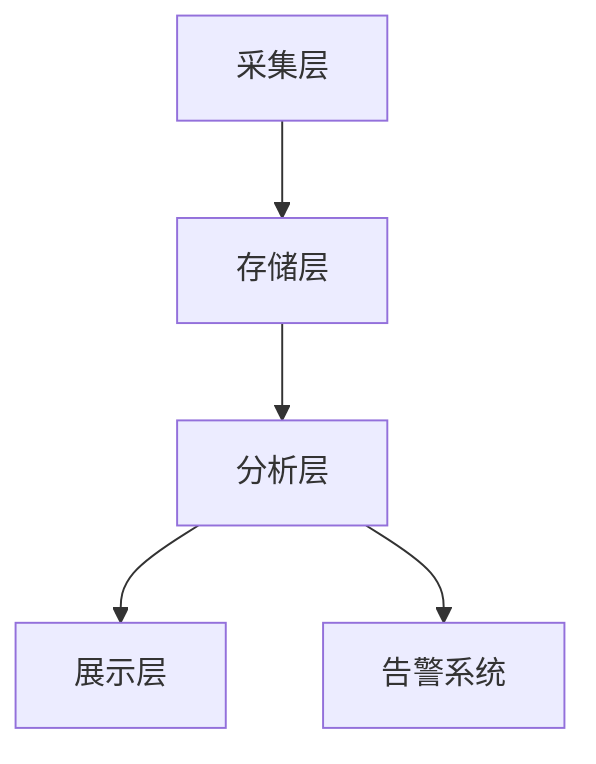
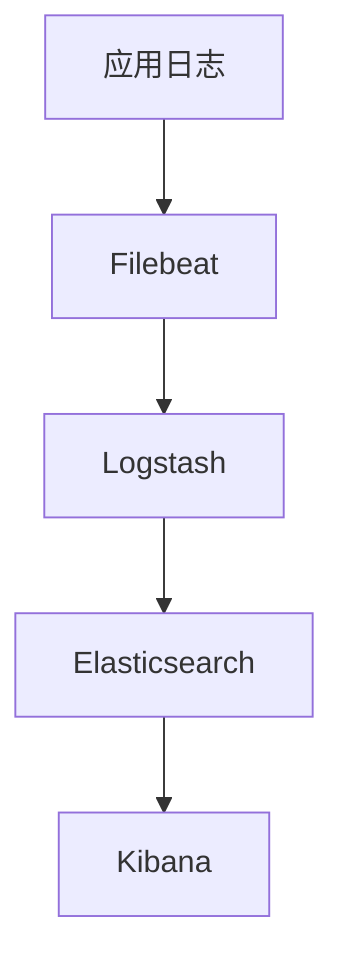

# 扣子平台监控运维指南

> 文档信息
- 版本：v1.0.0
- 更新日期：2024-03-15
- 状态：已发布
- 作者：运维团队
- 标签：#监控 #运维 #告警

## 目录
- [一、监控概述](#一监控概述)
- [二、监控指标](#二监控指标)
- [三、告警配置](#三告警配置)
- [四、日志管理](#四日志管理)
- [五、运维操作](#五运维操作)
- [六、故障处理](#六故障处理)

## 一、监控概述

### 1. 监控架构


### 2. 监控组件
```json
{
    "组件说明": {
        "采集组件": {
            "Node Exporter": "主机监控",
            "cAdvisor": "容器监控",
            "JMX Exporter": "JVM监控"
        },
        "存储组件": {
            "Prometheus": "时序数据库",
            "Elasticsearch": "日志存储"
        },
        "可视化": {
            "Grafana": "监控面板",
            "Kibana": "日志分析"
        }
    }
}
```

## 二、监控指标

### 1. 系统指标
| 指标类型 | 指标名称 | 说明 | 阈值 |
|---------|---------|------|------|
| CPU | cpu_usage | CPU使用率 | 80% |
| 内存 | memory_usage | 内存使用率 | 85% |
| 磁盘 | disk_usage | 磁盘使用率 | 90% |
| 网络 | network_io | 网络IO | 80% |

### 2. 应用指标
```json
{
    "性能指标": {
        "响应时间": {
            "说明": "API响应时间",
            "阈值": "500ms",
            "采集频率": "10s"
        },
        "并发数": {
            "说明": "系统并发请求数",
            "阈值": "1000/s",
            "采集频率": "5s"
        },
        "错误率": {
            "说明": "系统错误率",
            "阈值": "1%",
            "采集频率": "1min"
        }
    }
}
```

## 三、告警配置

### 1. 告警规则
```json
{
    "告警级别": {
        "严重": {
            "响应时间": "> 1s",
            "错误率": "> 5%",
            "CPU使用率": "> 90%"
        },
        "警告": {
            "响应时间": "> 500ms",
            "错误率": "> 1%",
            "CPU使用率": "> 80%"
        },
        "提醒": {
            "响应时间": "> 200ms",
            "错误率": "> 0.1%",
            "CPU使用率": "> 70%"
        }
    }
}
```

### 2. 通知配置
```json
{
    "通知方式": {
        "邮件": {
            "严重": "立即通知",
            "警告": "5分钟汇总",
            "提醒": "1小时汇总"
        },
        "短信": {
            "严重": "立即通知",
            "警告": "立即通知",
            "提醒": "不通知"
        },
        "企业微信": {
            "严重": "立即通知",
            "警告": "立即通知",
            "提醒": "1小时汇总"
        }
    }
}
```

## 四、日志管理

### 1. 日志架构


### 2. 日志配置
```json
{
    "日志级别": {
        "ERROR": "错误日志",
        "WARN": "警告日志",
        "INFO": "信息日志",
        "DEBUG": "调试日志"
    },
    "日志格式": {
        "时间戳": "ISO8601格式",
        "日志级别": "LOG_LEVEL",
        "服务名": "SERVICE_NAME",
        "追踪ID": "TRACE_ID",
        "日志内容": "MESSAGE"
    }
}
```

## 五、运维操作

### 1. 日常运维
```json
{
    "运维任务": {
        "日常巡检": {
            "系统状态": "每日检查",
            "日志分析": "每日汇总",
            "性能分析": "每周分析"
        },
        "容量规划": {
            "资源使用": "每周评估",
            "扩容预警": "提前规划",
            "成本优化": "月度优化"
        }
    }
}
```

### 2. 变更管理
```json
{
    "变更流程": {
        "变更申请": {
            "影响评估": "评估影响范围",
            "风险评估": "评估潜在风险",
            "回滚方案": "制定回滚计划"
        },
        "变更执行": {
            "执行时间": "低峰期执行",
            "执行步骤": "详细操作步骤",
            "监控验证": "变更后验证"
        }
    }
}
```

## 六、故障处理

### 1. 故障响应
```json
{
    "响应流程": {
        "故障发现": {
            "监控告警": "自动发现",
            "用户报告": "人工发现"
        },
        "故障定位": {
            "日志分析": "查看错误日志",
            "监控分析": "查看监控指标",
            "链路追踪": "分析调用链"
        },
        "故障处理": {
            "应急处理": "快速恢复",
            "根因分析": "找出根本原因",
            "长期解决": "制定解决方案"
        }
    }
}
```

### 2. 故障复盘
```json
{
    "复盘要素": {
        "故障描述": {
            "现象": "故障表现",
            "影响": "影响范围",
            "时间": "发生持续时间"
        },
        "处理过程": {
            "发现": "故障发现方式",
            "响应": "响应时间",
            "解决": "解决方案"
        },
        "改进措施": {
            "短期": "立即改进项",
            "中期": "系统优化",
            "长期": "架构改进"
        }
    }
}
```

## 参考资源

### 1. 相关文档
- [部署指南](/docs/deployment/README.md)
- [系统架构](/docs/architecture/system_architecture.md)
- [运维手册](/docs/operation/README.md)

### 2. 工具资源
- [监控面板](https://monitor.coze.cn)
- [日志平台](https://log.coze.cn)
- [告警配置](https://alert.coze.cn)

---
> 最后更新时间：2024-03-15 