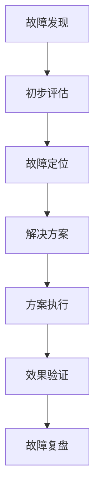

# 扣子平台运维手册

> 文档信息
- 版本：v1.0.0
- 更新日期：2024-03-15
- 状态：已发布
- 作者：曾子杰
- 标签：#运维 #故障处理 #系统维护

## 目录
- [一、日常运维](#一日常运维)
- [二、故障处理](#二故障处理)
- [三、系统维护](#三系统维护)
- [四、安全运维](#四安全运维)
- [五、性能调优](#五性能调优)

## 一、日常运维

### 1. 运维清单
```json
{
    "日常任务": {
        "系统巡检": {
            "频率": "每日",
            "内容": [
                "服务状态检查",
                "资源使用监控",
                "日志分析",
                "性能指标检查"
            ]
        },
        "数据备份": {
            "频率": "每日",
            "类型": [
                "数据库备份",
                "配置文件备份",
                "日志备份"
            ]
        },
        "安全检查": {
            "频率": "每周",
            "内容": [
                "安全日志审计",
                "漏洞扫描",
                "权限检查"
            ]
        }
    }
}
```

### 2. 监控指标
| 指标类型 | 监控项 | 正常范围 | 告警阈值 |
|---------|--------|---------|----------|
| CPU | 使用率 | <70% | >80% |
| 内存 | 使用率 | <80% | >90% |
| 磁盘 | 使用率 | <80% | >90% |
| 网络 | 带宽使用 | <70% | >80% |

## 二、故障处理

### 1. 故障响应流程


### 2. 常见故障处理
```json
{
    "故障类型": {
        "服务不可用": {
            "现象": "服务无法访问",
            "排查步骤": [
                "检查服务进程",
                "检查系统资源",
                "检查网络连接",
                "检查依赖服务"
            ],
            "解决方案": [
                "重启服务",
                "扩容资源",
                "修复网络"
            ]
        },
        "性能问题": {
            "现象": "服务响应慢",
            "排查步骤": [
                "检查系统负载",
                "检查数据库性能",
                "检查网络延迟",
                "分析慢查询"
            ],
            "解决方案": [
                "优化查询",
                "增加缓存",
                "扩容服务"
            ]
        }
    }
}
```

## 三、系统维护

### 1. 版本发布
```json
{
    "发布流程": {
        "准备阶段": {
            "版本确认": "确认发布版本",
            "变更评估": "评估影响范围",
            "制定计划": "详细发布计划"
        },
        "执行阶段": {
            "备份": "系统数据备份",
            "部署": "新版本部署",
            "验证": "功能验证"
        },
        "回滚预案": {
            "触发条件": "明确回滚条件",
            "回滚步骤": "详细回滚操作",
            "验证方法": "回滚后验证"
        }
    }
}
```

### 2. 容量规划
```json
{
    "规划维度": {
        "计算资源": {
            "CPU": "核心数规划",
            "内存": "内存容量规划",
            "存储": "存储容量规划"
        },
        "网络资源": {
            "带宽": "带宽容量规划",
            "连接数": "并发连接规划"
        },
        "存储资源": {
            "数据增长": "数据容量预估",
            "备份空间": "备份容量规划"
        }
    }
}
```

## 四、安全运维

### 1. 安全巡检
```json
{
    "巡检项目": {
        "系统安全": {
            "系统补丁": "检查系统补丁",
            "系统漏洞": "漏洞扫描",
            "系统加固": "安全加固检查"
        },
        "应用安全": {
            "权限检查": "检查权限配置",
            "日志审计": "安全日志分析",
            "配置检查": "安全配置检查"
        },
        "数据安全": {
            "数据备份": "备份完整性",
            "数据加密": "加密措施检查",
            "访问控制": "访问权限检查"
        }
    }
}
```

### 2. 应急响应
```json
{
    "应急预案": {
        "安全事件": {
            "级别划分": "事件等级定义",
            "响应流程": "处理流程",
            "恢复方案": "恢复步骤"
        },
        "数据泄露": {
            "影响评估": "泄露范围评估",
            "处置方案": "泄露处置方案",
            "预防措施": "防范措施"
        }
    }
}
```

## 五、性能调优

### 1. 性能监控
```json
{
    "监控维度": {
        "系统性能": {
            "CPU使用率": "监控CPU使用情况",
            "内存使用": "监控内存使用",
            "IO性能": "监控IO性能"
        },
        "应用性能": {
            "响应时间": "监控接口响应",
            "并发数": "监控并发请求",
            "错误率": "监控错误情况"
        },
        "数据库性能": {
            "连接数": "监控数据库连接",
            "查询性能": "监控慢查询",
            "缓存命中": "监控缓存效率"
        }
    }
}
```

### 2. 优化方案
```json
{
    "优化策略": {
        "系统优化": {
            "资源配置": "优化资源分配",
            "系统参数": "调整系统参数",
            "网络优化": "优化网络配置"
        },
        "应用优化": {
            "代码优化": "优化代码逻辑",
            "缓存优化": "优化缓存策略",
            "并发优化": "优化并发处理"
        },
        "数据库优化": {
            "索引优化": "优化数据库索引",
            "SQL优化": "优化SQL语句",
            "架构优化": "优化数据库架构"
        }
    }
}
```

## 参考资源

### 1. 相关文档
- [部署指南](/docs/deployment/README.md)
- [监控配置](/docs/monitoring/README.md)
- [最佳实践](/guides/best_practices.md)

### 2. 工具资源
- [监控平台](https://monitor.coze.cn)
- [日志平台](https://log.coze.cn)
- [运维工具集](https://github.com/coze/ops-tools)

---
> 最后更新时间：2024-03-15 