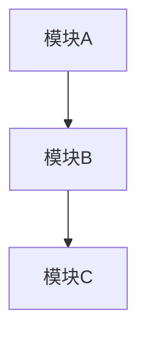

# 文档标题

> 文档信息
- 版本：v1.0.0
- 更新日期：YYYY-MM-DD
- 状态：[草稿/已发布/已废弃]
- 作者：作者名称
- 标签：[标签1, 标签2]

## 目录
- [一、概述](#一概述)
- [二、详细说明](#二详细说明)
- [三、使用指南](#三使用指南)
- [四、最佳实践](#四最佳实践)
- [五、常见问题](#五常见问题)
- [六、参考资源](#六参考资源)

## 一、概述

### 1. 功能简介
```json
{
    "核心功能": {
        "功能点1": "说明",
        "功能点2": "说明"
    }
}
```

### 2. 适用范围
- 适用场景1
- 适用场景2

### 3. 特性列表
- 特性1
- 特性2

## 二、详细说明

### 1. 技术架构


### 2. 核心参数
| 参数名 | 类型 | 必填 | 说明 | 示例 |
|-------|------|-----|------|------|
| param1 | String | 是 | 参数1说明 | "example" |
| param2 | Integer | 否 | 参数2说明 | 100 |

## 三、使用指南

### 1. 基础用法
```javascript
// 示例代码
const example = {
    param1: "value1",
    param2: 100
};
```

### 2. 进阶用法
```javascript
// 进阶示例代码
const advancedExample = {
    // 代码示例
};
```

## 四、最佳实践

### 1. 推荐配置
```json
{
    "配置项": {
        "选项1": "推荐值",
        "选项2": "推荐值"
    }
}
```

### 2. 性能优化
- 优化建议1
- 优化建议2

## 五、常见问题

### 1. 问题列表
1. Q: 常见问题1？
   A: 解决方案1

2. Q: 常见问题2？
   A: 解决方案2

### 2. 故障排除
- 故障1的处理方法
- 故障2的处理方法

## 六、参考资源

### 1. 相关文档
- [文档1](相对路径或URL)
- [文档2](相对路径或URL)

### 2. 示例代码
- [示例1](相对路径或URL)
- [示例2](相对路径或URL)

---
> 文档结束 