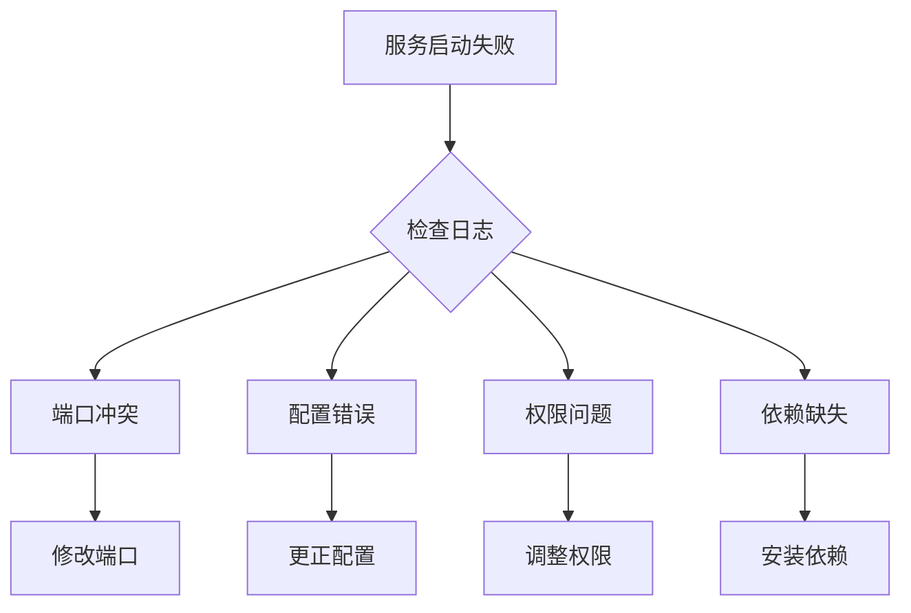
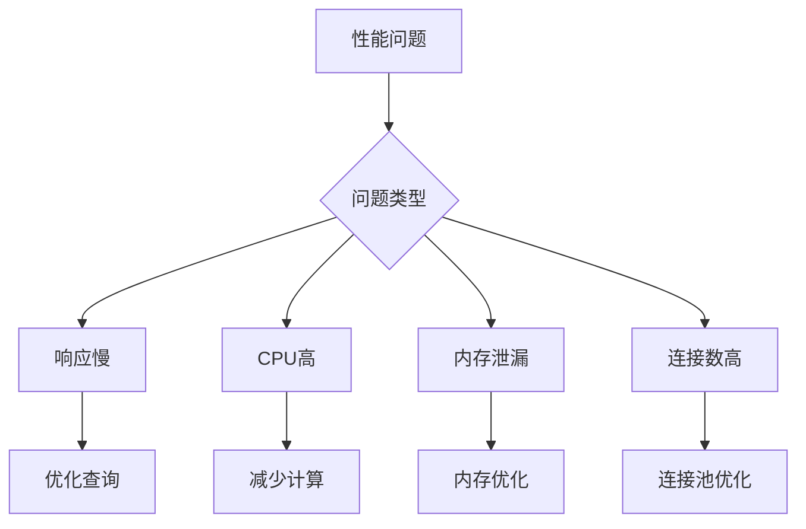

# 扣子平台故障排除指南

> 文档信息
- 版本：v1.0.0
- 更新日期：2024-03-15
- 状态：已发布
- 作者：曾子杰
- 标签：#故障排除 #问题诊断 #解决方案

## 目录
- [一、系统故障](#一系统故障)
- [二、API故障](#二api故障)
- [三、性能故障](#三性能故障)
- [四、数据故障](#四数据故障)
- [五、安全故障](#五安全故障)

## 一、系统故障

### 1. 服务启动故障


### 2. 诊断步骤
```json
{
    "故障诊断": {
        "日志检查": {
            "系统日志": "/var/log/system.log",
            "应用日志": "/var/log/coze/app.log",
            "错误日志": "/var/log/coze/error.log"
        },
        "状态检查": {
            "服务状态": "systemctl status coze",
            "进程状态": "ps aux | grep coze",
            "端口状态": "netstat -nltp"
        },
        "配置检查": {
            "配置文件": "/etc/coze/config.yaml",
            "环境变量": "env | grep COZE"
        }
    }
}
```

### 3. 解决方案
```json
{
    "常见问题": {
        "端口冲突": {
            "诊断": "netstat -nltp | grep 端口号",
            "解决": [
                "修改配置文件中的端口",
                "停止占用端口的进程",
                "使用备用端口"
            ]
        },
        "权限不足": {
            "诊断": "ls -la /path/to/file",
            "解决": [
                "调整文件权限",
                "修改用户组",
                "使用sudo运行"
            ]
        },
        "配置错误": {
            "诊断": "检查配置文件语法",
            "解决": [
                "对照模板修改",
                "使用配置验证工具",
                "恢复默认配置"
            ]
        }
    }
}
```

## 二、API故障

### 1. 接口错误
```json
{
    "错误类型": {
        "认证错误": {
            "错误码": "401/403",
            "可能原因": [
                "Token无效",
                "权限不足",
                "签名错误"
            ],
            "解决方案": [
                "更新Token",
                "检查权限配置",
                "验证签名算法"
            ]
        },
        "请求错误": {
            "错误码": "400/404",
            "可能原因": [
                "参数错误",
                "资源不存在",
                "方法不允许"
            ],
            "解决方案": [
                "检查请求参数",
                "验证资源路径",
                "确认请求方法"
            ]
        },
        "服务器错误": {
            "错误码": "500/503",
            "可能原因": [
                "内部错误",
                "服务不可用",
                "超时"
            ],
            "解决方案": [
                "查看错误日志",
                "检查服务状态",
                "联系技术支持"
            ]
        }
    }
}
```

### 2. 调试方法
```json
{
    "调试工具": {
        "API测试工具": {
            "Postman": "接口测试",
            "curl": "命令行测试",
            "SDK调试模式": "开发调试"
        },
        "日志分析": {
            "请求日志": "分析请求详情",
            "响应日志": "检查响应结果",
            "错误日志": "定位错误原因"
        }
    }
}
```

## 三、性能故障

### 1. 性能问题诊断


### 2. 监控指标
```json
{
    "关键指标": {
        "系统层": {
            "CPU使用率": "top命令",
            "内存使用": "free命令",
            "磁盘IO": "iostat命令",
            "网络IO": "netstat命令"
        },
        "应用层": {
            "响应时间": "API延迟统计",
            "并发数": "连接数统计",
            "错误率": "错误日志统计",
            "QPS": "请求量统计"
        },
        "数据库层": {
            "连接数": "show processlist",
            "查询性能": "slow query log",
            "缓存命中": "cache hit ratio"
        }
    }
}
```

### 3. 优化方案
```json
{
    "优化策略": {
        "代码优化": {
            "算法优化": "优化计算逻辑",
            "缓存使用": "增加缓存层",
            "异步处理": "使用消息队列"
        },
        "配置优化": {
            "JVM参数": "调整内存配置",
            "连接池": "优化连接参数",
            "线程池": "调整线程数"
        },
        "架构优化": {
            "负载均衡": "增加节点",
            "数据分片": "水平拆分",
            "服务降级": "熔断限流"
        }
    }
}
```

## 四、数据故障

### 1. 数据问题
```json
{
    "数据异常": {
        "数据丢失": {
            "可能原因": [
                "备份失败",
                "误操作",
                "系统故障"
            ],
            "解决方案": [
                "恢复备份",
                "数据修复",
                "日志回放"
            ]
        },
        "数据不一致": {
            "可能原因": [
                "并发冲突",
                "同步失败",
                "缓存问题"
            ],
            "解决方案": [
                "数据校验",
                "强制同步",
                "缓存刷新"
            ]
        }
    }
}
```

### 2. 数据恢复
```json
{
    "恢复策略": {
        "备份恢复": {
            "全量恢复": "使用完整备份",
            "增量恢复": "应用增量日志",
            "时间点恢复": "选择还原点"
        },
        "数据修复": {
            "手动修复": "直接修改数据",
            "工具修复": "使用修复工具",
            "脚本修复": "编写修复脚本"
        }
    }
}
```

## 五、安全故障

### 1. 安全问题
```json
{
    "安全事件": {
        "未授权访问": {
            "可能原因": [
                "权限配置错误",
                "凭证泄露",
                "漏洞利用"
            ],
            "解决方案": [
                "审计访问日志",
                "更新安全策略",
                "加强访问控制"
            ]
        },
        "数据泄露": {
            "可能原因": [
                "权限过大",
                "传输未加密",
                "备份不安全"
            ],
            "解决方案": [
                "最小权限原则",
                "加密传输",
                "安全备份"
            ]
        }
    }
}
```

### 2. 应急响应
```json
{
    "响应流程": {
        "发现与报告": {
            "监控告警": "安全监控系统",
            "用户报告": "问题反馈渠道",
            "安全扫描": "漏洞扫描"
        },
        "分析与处置": {
            "影响评估": "评估影响范围",
            "原因分析": "定位问题原因",
            "解决方案": "制定解决方案"
        },
        "恢复与总结": {
            "系统恢复": "恢复正常运行",
            "加固措施": "实施安全加固",
            "复盘总结": "总结经验教训"
        }
    }
}
```

## 参考资源

### 1. 相关文档
- [系统架构](/docs/architecture/system_architecture.md)
- [运维手册](/docs/operation/README.md)
- [安全指南](/docs/security/README.md)

### 2. 工具资源
- [监控平台](https://monitor.coze.cn)
- [日志平台](https://log.coze.cn)
- [故障报告](https://status.coze.cn)

---
> 最后更新时间：2024-03-15 