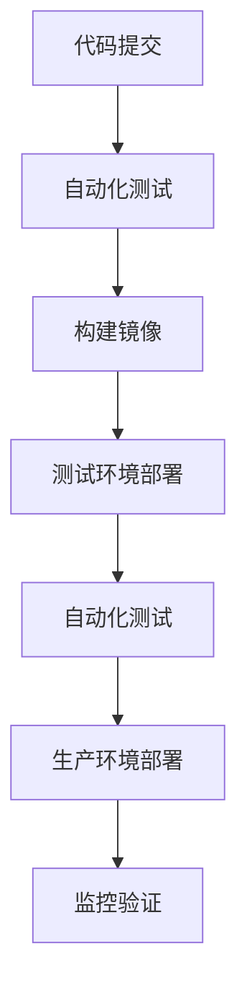

# 扣子平台最佳实践指南

> 文档信息
- 版本：v1.0.0
- 更新日期：2024-03-15
- 状态：已发布
- 作者：曾子杰
- 标签：#最佳实践 #开发规范 #运维指南

## 目录
- [一、开发最佳实践](#一开发最佳实践)
- [二、部署最佳实践](#二部署最佳实践)
- [三、运维最佳实践](#三运维最佳实践)
- [四、安全最佳实践](#四安全最佳实践)
- [五、性能优化](#五性能优化)

## 一、开发最佳实践

### 1. 代码规范
```json
{
    "编码规范": {
        "命名规范": {
            "变量命名": "驼峰命名法",
            "常量命名": "大写下划线",
            "类命名": "首字母大写",
            "文件命名": "小写下划线"
        },
        "注释规范": {
            "文件注释": "文件头部必须包含版权信息",
            "函数注释": "描述功能、参数和返回值",
            "关键代码注释": "解释复杂逻辑"
        },
        "格式规范": {
            "缩进": "4个空格",
            "最大行长": "120字符",
            "空行规则": "逻辑块之间空一行"
        }
    }
}
```

### 2. API设计
```json
{
    "API设计原则": {
        "RESTful规范": {
            "资源命名": "使用名词复数",
            "版本控制": "在URL中包含版本号",
            "状态码使用": "准确使用HTTP状态码"
        },
        "接口设计": {
            "参数校验": "严格的参数验证",
            "错误处理": "统一的错误响应格式",
            "分页处理": "统一的分页参数"
        }
    }
}
```

## 二、部署最佳实践

### 1. 环境管理
```json
{
    "环境配置": {
        "开发环境": {
            "特点": "本地开发使用",
            "配置": "开发配置",
            "日志": "详细日志"
        },
        "测试环境": {
            "特点": "功能测试使用",
            "配置": "类生产配置",
            "日志": "完整日志"
        },
        "生产环境": {
            "特点": "线上运行环境",
            "配置": "生产配置",
            "日志": "精简日志"
        }
    }
}
```

### 2. 部署流程


## 三、运维最佳实践

### 1. 监控策略
```json
{
    "监控维度": {
        "系统监控": {
            "CPU使用率": "阈值80%",
            "内存使用率": "阈值85%",
            "磁盘使用率": "阈值90%"
        },
        "应用监控": {
            "响应时间": "阈值500ms",
            "错误率": "阈值1%",
            "QPS": "阈值1000"
        },
        "业务监控": {
            "用户活跃度": "DAU指标",
            "功能使用率": "核心功能使用情况",
            "错误分布": "错误类型统计"
        }
    }
}
```

### 2. 日志管理
```json
{
    "日志规范": {
        "日志级别": {
            "ERROR": "错误日志",
            "WARN": "警告日志",
            "INFO": "信息日志",
            "DEBUG": "调试日志"
        },
        "日志格式": {
            "时间戳": "ISO8601格式",
            "日志级别": "大写字母",
            "服务名称": "服务标识",
            "追踪ID": "请求追踪",
            "日志内容": "具体信息"
        }
    }
}
```

## 四、安全最佳实践

### 1. 安全配置
```json
{
    "安全措施": {
        "接入安全": {
            "HTTPS": "强制HTTPS",
            "API认证": "JWT + OAuth2",
            "请求加密": "传输层加密"
        },
        "数据安全": {
            "存储加密": "敏感数据加密",
            "访问控制": "RBAC权限模型",
            "数据备份": "定期备份策略"
        }
    }
}
```

### 2. 安全审计
```json
{
    "审计内容": {
        "访问审计": "记录所有API访问",
        "操作审计": "记录关键操作",
        "安全事件": "记录安全警告",
        "系统变更": "记录配置修改"
    }
}
```

## 五、性能优化

### 1. 应用优化
```json
{
    "优化方向": {
        "代码优化": {
            "内存管理": "及时释放资源",
            "算法优化": "选择合适算法",
            "缓存使用": "合理使用缓存"
        },
        "数据库优化": {
            "索引优化": "创建合适索引",
            "查询优化": "优化SQL语句",
            "连接池": "配置连接池"
        }
    }
}
```

### 2. 架构优化
```json
{
    "架构优化": {
        "服务拆分": "合理的服务粒度",
        "缓存策略": "多级缓存架构",
        "异步处理": "使用消息队列",
        "负载均衡": "合理的负载策略"
    }
}
```

## 参考资源

### 1. 相关文档
- [开发指南](/docs/development/README.md)
- [部署指南](/docs/deployment/README.md)
- [API文档](/docs/api/api_reference.md)
- [监控运维](/docs/monitoring/README.md)

### 2. 工具资源
- [代码规范检查工具](https://github.com/coze/lint-config)
- [API测试工具](https://github.com/coze/api-test)
- [监控面板](https://monitor.coze.cn)

---
> 最后更新时间：2024-03-15 